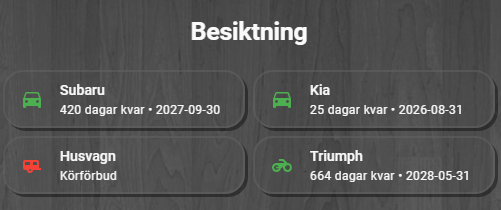

# Swedish Vehicle Information (Car.info Integration)

Ett Home Assistant‑tillägg som hämtar fordonsinformation från **Car.info** (med
**biluppgifter.se** som kompletterande källa och automatisk fallback) baserat
på svenska registreringsnummer.  
Integrationens fokus är att leverera fem centrala värden:

- **I trafik** – Fordonets trafikstatus  
- **Besiktad** – Datum för senaste besiktning  
- **Besiktas senast** – Sista datum för nästa besiktning
- **Körförbud** - Har sista datum för besiktning passerats
- **Fabrikat** - Fordonets märke/modell, t.ex. Subaru eller Kia

Detta gör integrationen enkel, snabb och stabil utan beroenden till Transportstyrelsen som har ett invecklat system.

---

## ✨ Funktioner

- Hämtar fordonsdata från Car.info, med biluppgifter.se som fallback-källa
- Stöd för flera registreringsnummer (komma‑separerade)
- Visar status som sensor‑state (`Ja`/`Nej`, normaliserat oavsett vilken källa som svarade)
- Visar besiktningsdata och fordonets senast använda datakälla som attribut
- Adaptivt, veckodagsschemalagt uppdateringsintervall — hämtar oftare ju närmare besiktningen är (se nedan)
- Fullt stöd för Home Assistant config‑flow

---

## 📦 Installation

Det rekommenderade sättet att installera integrationen är via **HACS**.

### 1. Lägg till som Custom Repository
1. Öppna **HACS** i Home Assistant  
2. Gå till **Integrations**  
3. Klicka på **⋮ (meny) → Custom repositories**  
4. Lägg till ditt GitHub‑repo: https://github.com/AcidSleeper/ha-swedish-vehicle-information/ 
5. Välj kategori: **Integration**

### 2. Installera integrationen
1. Sök efter **Swedish Vehicle Information** i HACS  
2. Installera  
3. Starta om Home Assistant

---

## ⚙️ Konfiguration

1. Gå till **Inställningar → Enheter & tjänster**
2. Klicka på **Lägg till integration**
3. Sök efter **Swedish Vehicle Information**
4. Ange ett eller flera registreringsnummer, t.ex.:

ABC123, ACB132

Klart!

---

## 📊 Sensorer

För varje registreringsnummer skapas en sensor:

### **State**
- `Ja` – fordonet är i trafik
- `Nej` – fordonet är avställt, avregistrerat eller på annat sätt inte i trafik

*(Normaliserat till samma format oavsett om datan kom från Car.info eller
biluppgifter.se — biluppgifter.se skriver annars ut t.ex. "I Trafik" som rått
värde, vilket integrationen räknar om till `Ja`/`Nej`.)*

### **Attribut**
- `fabrikat` – fordonets märke, t.ex. Subaru. Hämtas alltid från
  biluppgifter.se:s dedikerade märkesfält (mer tillförlitligt än Car.infos
  sidtitel, som visat sig kunna feltolka vissa fordons märke) och cachas per
  registreringsnummer eftersom fabrikatet aldrig ändras för ett givet fordon
- `besiktad` – senaste besiktning  
- `besiktas_senast` – nästa besiktning  
- `registreringsnummer` - ABC123
- `korforbud` - ja eller nej
- `kalla` - vilken källa den senaste **status/besiktningsdatan** hämtades
  från: `car.info` eller `biluppgifter.se` (styr inte `fabrikat`, se ovan)

---

## 🔄 Uppdateringsintervall

Integrationen använder ett **adaptivt, veckodagsschemalagt** uppdateringsintervall
per registreringsnummer, istället för ett fast intervall för alla fordon. Det
håller nere antalet anrop till källorna, särskilt om du har flera fordon.

Car.info och biluppgifter.se hämtar sin grunddata från Transportstyrelsen
ungefär en gång i veckan (Car.info natten mot tisdag, biluppgifter.se oftast
kring fredag) — men exakt när en enskild uppdatering dyker upp hos någon av
källorna kan variera. Integrationen anpassar sina hämtningar efter det:

| Dagar kvar till besiktning | Hämtas på nytt |
|---|---|
| Mer än 3 veckor | Var 14:e dag, alltid en tisdag kl 10:00, via Car.info |
| 2–3 veckor | Varje tisdag kl 10:00, via Car.info |
| Mindre än 2 veckor (eller redan körförbud) | **Varje dag** kl 10:00 — Car.info de flesta dagarna, biluppgifter.se på fredagar |

Ju närmare besiktningen är, desto oftare kontrolleras alltså fordonet — och i
det sista, mest tidskritiska läget slås källorna ihop till en daglig kontroll
istället för att bara luta sig mot en enda schemalagd dag i veckan, eftersom
en uppdatering hos källorna ibland kan dyka upp tidigare än förväntat.

**Fallback vid fel:** misslyckas hämtningen från den ordinarie källan för ett
schemalagt tillfälle (t.ex. nätverksfel eller att sidan ändrat struktur),
provas den andra källan automatiskt istället — åt båda hållen.

Alla registreringsnummer hämtas alltid direkt vid uppstart av Home Assistant,
via Car.info, oavsett vilken veckodag Home Assistant råkar starta om på.

---

## 🧩 Datakällor

Data hämtas i första hand från Car.info:

https://www.car.info/sv-se/license-plate/S/<REGNUMMER>

och vid behov (schemalagt fredagsfönster, daglig kontroll nära besiktning,
eller fallback vid fel) från biluppgifter.se:

https://biluppgifter.se/fordon/<regnummer>/

---

## 🖥️ Dashboard-exempel (valfritt)

Repot innehåller ett exempel på en färdig dashboard-vy för besiktningsinformation,
byggd med [Mushroom Cards](https://github.com/piitaya/lovelace-mushroom) och
[card-mod](https://github.com/thomasloven/lovelace-card-mod). Det här är **valfritt**
och installeras inte automatiskt av HACS — filerna behöver kopieras manuellt till din
Home Assistant-konfiguration.



### Förutsättningar

Innan du använder exempel-dashboarden behöver följande vara installerat via HACS:

- [Mushroom Cards](https://github.com/piitaya/lovelace-mushroom) (`custom:mushroom-template-card`)
- [card-mod](https://github.com/thomasloven/lovelace-card-mod)

### 1. Jinja-mallar (`custom_templates/fordon_status.jinja`)

Filen innehåller Jinja-macron som räknar ut dagar kvar till besiktning, väljer
ikonfärg baserat på körförbud, och formaterar sekundärtexten i korten.

**Installation:**

1. Kopiera `custom_templates/fordon_status.jinja` från repot till
   `config/custom_templates/fordon_status.jinja` i din Home Assistant-installation
   (skapa mappen `custom_templates` om den inte redan finns).
2. Starta om Home Assistant.

Macrona importeras i dashboard-korten med:

```jinja2

{{ secondary('sensor.vehicle_xxx000') }}
```

### 2. Färdigt dashboard-kort (`UI-suggestions/besiktning.yaml`)

Mappen `UI-suggestions/` innehåller ett komplett `vertical-stack`-kort
(`besiktning.yaml`) som visar en ruta per fordon med fabrikat, ikon,
dagar kvar till besiktning och röd markering vid körförbud.

**Installation:**

1. Kopiera innehållet i `UI-suggestions/besiktning.yaml`.
2. I din dashboard: lägg till ett nytt kort → växla till YAML-läge → klistra in.
3. Byt ut `entity`-värdena (t.ex. `sensor.vehicle_xxx000`) mot dina egna
   registreringsnummer-sensorer.

> **Obs:** Kortet förutsätter att `fordon_status.jinja` (steg 1 ovan) redan är
> installerad — annars visas ett template-fel i loggen.

---

## 🛠 Support

Detta tillägg är skapat för privat bruk och är inte officiellt kopplat till Car.info. 
Fordon som testats är personbil, motorcykel, släpvagn och moped.
För frågor, förbättringar eller buggar — öppna ett ärende i GitHub‑repot.
